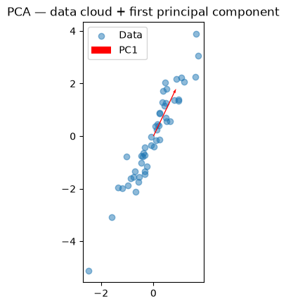

# math-for-ml

Applied linear algebra, probability/statistics, calculus, optimization, and
information theory — self-taught, from first principles, in preparation for
Year 2/3 ML and NLP work. Separate from `python-practice` (general Python
drilling) — this repo is a focused math foundation, not tutorial practice.

## Structure
Files numbered `01`–`30`, one topic per file, in sequence:
- `01`–`10`: Linear Algebra
- `11`–`18`: Probability & Statistics
- `19`–`23`: Calculus & Optimization
- `24`–`25`: Linear Algebra (Advanced) — SVD, decompositions
- `26`–`27`: Information Theory
- `28`–`29`: Probability (Advanced) — Markov chains, sequence probabilitgit y
- `30`: Capstone — gradient descent from scratch, no ML libraries

Each file is self-contained: implementation + verification (asserts, not
just prints) + where relevant, a plotted geometric visualization.

## Linear Algebra (Files 01–10)
Vectors, dot product, cosine similarity, matrix operations, determinants,
eigenvalues/eigenvectors, rank, and PCA from scratch — no sklearn.

## Tech stack
- Python, NumPy, Matplotlib

## Status
In progress — started Aug 2, 2026.
- ✅ Linear Algebra (Files 01–10) — complete
- ✅ Probability & Statistics (Files 11–18)
- ⬜ Calculus & Optimization (Files 19–23)
- ⬜ Linear Algebra Advanced (Files 24–25)
- ⬜ Information Theory (Files 26–27)
- ⬜ Probability Advanced (Files 28–29)
- ⬜ Final Capstone (File 30)

## Author
Rania Rashid — [LinkedIn](https://www.linkedin.com/in/rania-rashid00/)